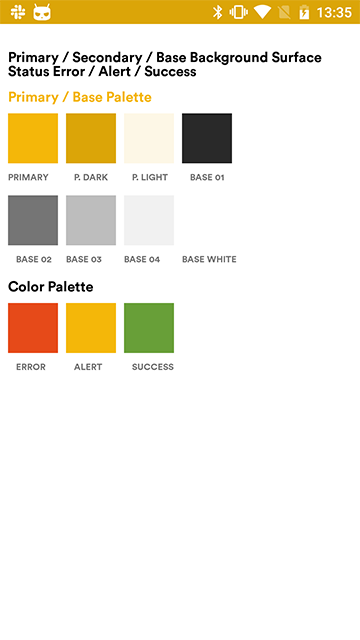
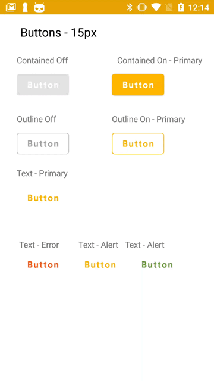
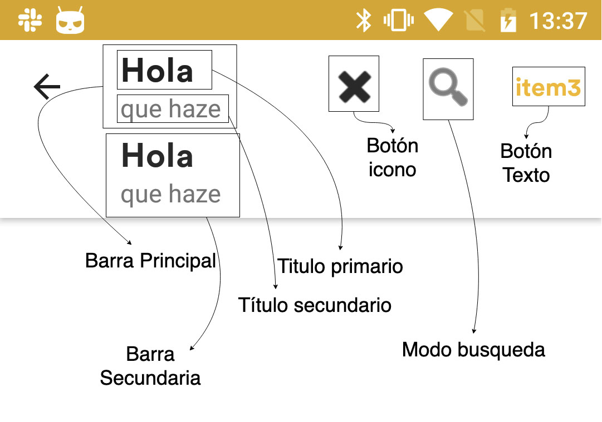
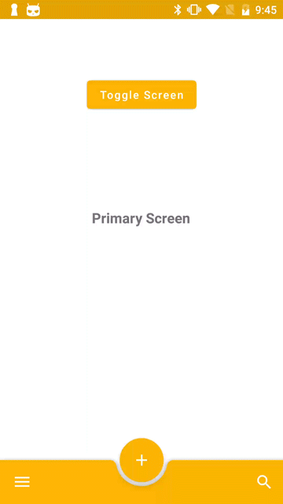
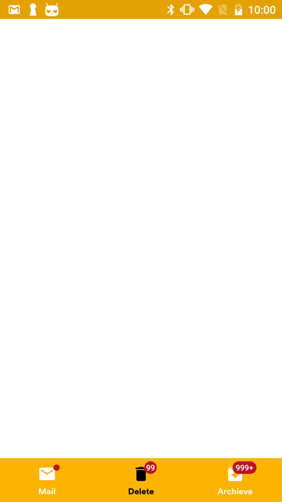
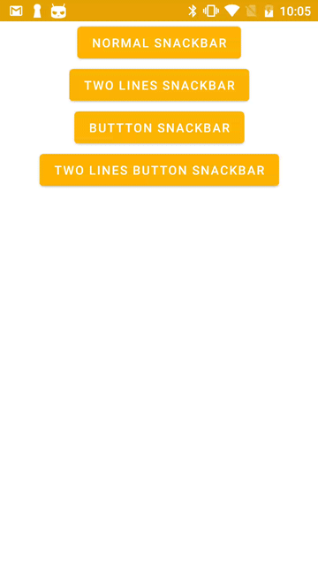
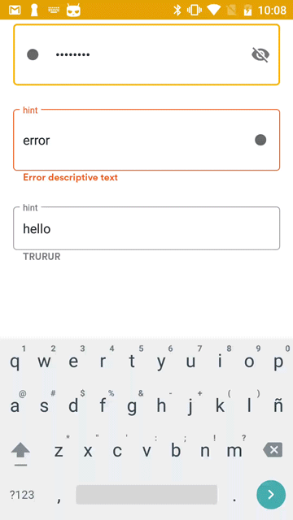

# Batura Design System Android!

# Colores

Los colores primarios son dependiente de cada proyecto pero en este caso vamos a tener tres tipos de colores primarios.

 1. Primary
 2. Primary Dark
 3. Primary Light
 4. En caso de android el color accent es igual que el color primario

**En cambio vamos a tener los siguientes colores predefinidos.**

**Base01** #292929
**Base02** #757575
**Base03** #BDBDBD
**Base04** #F1F1F1
**BaseWhite** #FFFFFF
**Error** #e64a19
**Alert** #f4b709
**Sucess** #689f38


```xml
<color name="colorPrimary">#F4B709</color>  
<color name="colorPrimaryDark">#dba508</color>  
<color name="colorPrimaryLight">#fdf7e6</color>  
<color name="base_1">#292929</color>  
<color name="base_2">#757575</color>  
<color name="base_3">#BDBDBD</color>  
<color name="base_4">#F1F1F1</color>  
<color name="basewhite">#FFFFFF</color>  
<color name="colorAccent">#f4b709</color>  
<color name="success">#689f38</color>  
<color name="alert">#f4b709</color>  
<color name="error">#e64a19</color>  
  
<color name="colorSnackbarButton">#ef7f3e</color>  
  
<color name="colorPrimary_70">#B3F4B709</color>  
<color name="alert_70">#B3F4B709</color>  
<color name="error_70">#B3E64A19</color>  
<color name="success_70">#B3689F38</color>
```

# Botones


```xml
<!-- Buttons Styles -->  
<style name="materialButton" parent="Widget.MaterialComponents.Button">  
 <item name="android:textSize">15sp</item>  
 <item name="android:fontFamily">@font/bold</item>  
 <item name="android:textAllCaps">false</item>  
 <item name="colorAccent">@color/colorPrimary</item>  
 <item name="android:textColor">@android:color/white</item>  
  
</style>  
  
<style name="materialSummitButton" parent="Widget.MaterialComponents.Button">  
 <item name="android:textSize">15sp</item>  
 <item name="android:fontFamily">@font/bold</item>  
 <item name="android:textAllCaps">false</item>  
 <item name="colorAccent">@color/colorPrimary</item>  
 <item name="android:textColor">@android:color/white</item>  
  
</style>  
  
<style name="outlineMaterialButton" parent="Widget.MaterialComponents.Button.OutlinedButton">  
 <item name="android:textSize">15sp</item>  
 <item name="android:fontFamily">@font/bold</item>  
 <item name="android:textAllCaps">false</item>  
 <item name="strokeColor">@color/out_lined_stroke</item>  
  
</style>  
  
<style name="textMaterialButton" parent="Widget.MaterialComponents.Button.TextButton">  
 <item name="android:textSize">15sp</item>  
 <item name="android:fontFamily">@font/bold</item>  
 <item name="android:textAllCaps">false</item>  
</style>  
  
<style name="errorTextMaterialButton" parent="Widget.MaterialComponents.Button.TextButton">  
 <item name="android:textSize">15sp</item>  
 <item name="android:fontFamily">@font/bold</item>  
 <item name="android:textAllCaps">false</item>  
 <item name="rippleColor">@color/error</item>  
 <item name="android:textColor">@color/error_text_color</item>  
</style>  
  
<style name="alertTextMaterialButton" parent="Widget.MaterialComponents.Button.TextButton">  
 <item name="android:textSize">15sp</item>  
 <item name="android:fontFamily">@font/bold</item>  
 <item name="android:textAllCaps">false</item>  
 <item name="rippleColor">@color/alert</item>  
 <item name="android:textColor">@color/alert_text_color</item>  
  
</style>  
  
<style name="successTextMaterialButton" parent="Widget.MaterialComponents.Button.TextButton">  
 <item name="android:textSize">15sp</item>  
 <item name="android:fontFamily">@font/bold</item>  
 <item name="android:textAllCaps">false</item>  
 <item name="rippleColor">@color/success</item>  
 <item name="android:textColor">@color/sucess_text_color</item>  
</style>
```
# Textos

```xml
<style name="Button" parent="TextAppearance.MaterialComponents.Button">  
 <item name="android:textSize">15sp</item>  
 <item name="android:letterSpacing">0.09</item>  
 <item name="android:lineSpacingExtra">1sp</item>  
 <item name="android:textColor">@color/text_color</item>  
 <item name="android:fontFamily">@font/bold</item>  
 <item name="android:textAllCaps">false</item>  
 <item name="android:textColorPrimaryDisableOnly">@color/colorPrimary</item>  
</style>  
  
<style name="Head1Bold" parent="android:TextAppearance.Material">  
 <item name="android:fontFamily">@font/bold</item>  
 <item name="android:textSize">34sp</item>  
  
 <item name="android:textColor">@color/base_1</item>  
</style>  
  
<style name="Head2Bold" parent="android:TextAppearance.Material">  
 <item name="android:fontFamily">@font/bold</item>  
 <item name="android:textSize">28sp</item>  
 <item name="android:lineSpacingExtra">6sp</item>  
 <item name="android:textColor">@color/base_1</item>  
</style>  
   
<style name="Head3Bold" parent="android:TextAppearance.Material">  
 <item name="android:fontFamily">@font/bold</item>  
 <item name="android:textSize">22sp</item>  
 <item name="android:lineSpacingExtra">6sp</item>  
 <item name="android:textColor">@color/base_1</item>  
</style>  
  
<style name="Head4" parent="android:TextAppearance.Material">  
 <item name="android:textSize">20sp</item>  
 <item name="android:letterSpacing">0.02</item>  
 <item name="android:lineSpacingExtra">4sp</item>  
 <item name="android:textColor">@color/base_1</item>  
</style>  
  
<style name="Head4Regular" parent="Head4">  
 <item name="android:fontFamily">@font/medium</item>  
</style>  
    
<style name="Head4Bold" parent="Head4">  
 <item name="android:fontFamily">@font/bold</item>  
</style>  
  
<style name="Body1" parent="android:TextAppearance.Material">  
 <item name="android:textSize">17sp</item>  
 <item name="android:lineSpacingExtra">7sp</item>  
 <item name="android:textColor">@color/base_1</item>  
</style>  
 
<style name="Body1Light" parent="Body1">  
 <item name="android:fontFamily">@font/book</item>  
</style>  
  
<style name="Body1Bold" parent="Body1">  
 <item name="android:fontFamily">@font/bold</item>  
</style>  
  
<style name="Body1Regular" parent="Body1">  
 <item name="android:fontFamily">@font/medium</item>  
</style>  
  
<style name="Body2" parent="android:TextAppearance.Material">  
 <item name="android:textSize">15sp</item>  
 <item name="android:lineSpacingExtra">5sp</item>  
 <item name="android:textColor">@color/base_1</item>  
</style>  
  
<style name="Body2Light" parent="Body2">  
 <item name="android:fontFamily">@font/book</item>  
</style>  
  
<style name="Body2Bold" parent="Body2">  
 <item name="android:fontFamily">@font/bold</item>  
</style>  
  
<style name="Body2Regular" parent="Body2">  
 <item name="android:fontFamily">@font/medium</item>  
</style>  
  
<style name="Caption1" parent="android:TextAppearance.Material">  
 <item name="android:textSize">13sp</item>  
 <item name="android:lineSpacingExtra">3sp</item>  
 <item name="android:textColor">@color/base_1</item>  
</style>  
  
<style name="Caption1Regular" parent="Caption1">  
 <item name="android:fontFamily">@font/medium</item>  
</style>  
  
<style name="Caption1Bold" parent="Caption1">  
 <item name="android:fontFamily">@font/bold</item>  
</style>  
  
<style name="Caption2" parent="android:TextAppearance.Material">  
 <item name="android:textSize">11sp</item>  
 <item name="android:textColor">@color/base_1</item>  
</style>  
  
<style name="Caption2Regular" parent="Caption2">  
 <item name="android:fontFamily">@font/medium</item>  
</style>  
  
<style name="Caption2Bold" parent="Caption2">  
 <item name="android:fontFamily">@font/bold</item>  
</style>
```
# TopBar

# BottomBar

# Bottom Navigation

# Toast - SnackBars

# Forms

# List


# Dialogs
